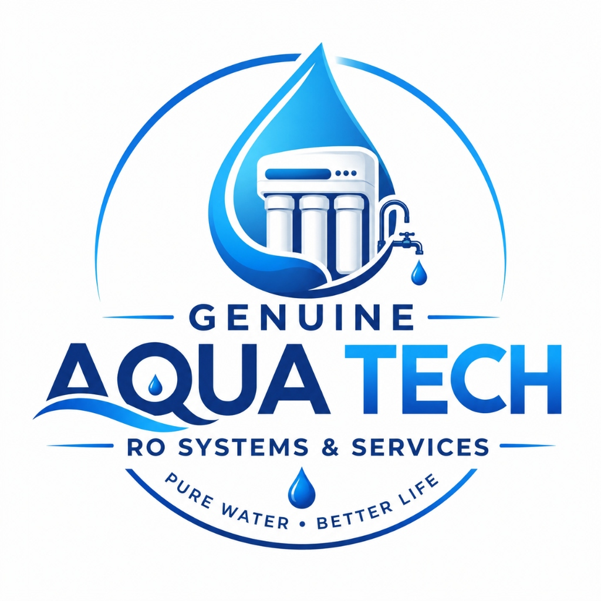

# The Coding Journey: Genuine Aqua RO Systems & Services

Welcome to the start of the development journey for **Genuine Aqua RO Systems and Services**. This document preserves the initial conversation and design steps that launched the project.

---

## 💬 The Launch Conversation

### 🟢 1. Setting Off
> **User:**
> *"hey gravity looking forward for our journey"*

> **Antigravity:**
> *"Hello! I'm Antigravity, your AI coding assistant. I'm excited to work with you on your coding journey!*
>
> *Whether you want to build a new web application, explore some code, debug an issue, or design something from scratch, I'm ready to help.*
>
> *Since we don't have an active workspace set up yet, let me know what you'd like to build or work on, and we can get started by setting up a project directory. What are we building today?"*

---

### 🟢 2. Designing the Brand Identity
> **User:**
> *"i will give your first task hey chat act as a logo designer and please create me a logo for this company i need it with blue theme and the company name : Genuine Aqua Ro tech systems and services"*

> **Antigravity:**
> *I have generated the first logo design for **Genuine Aqua Ro Tech Systems and Services**.*
>
> *You can view the design and read about the concept in [logo_design.md](logo_design.md).*
>
> #### 🎨 Design Concept Summary:
> * **Blue Theme:** Professional gradient of deep navy blue (reliability, structure, professional services) and vibrant cyan (purity, water, technology).
> * **Emblem:** Sleek, abstract water droplet merged with filtration rings representing Reverse Osmosis (RO) and engineering.
> * **Typography:** Modern, minimalist sans-serif for a premium corporate feel.

#### Generated Logo Design:

---

### 🟢 3. Planning the Web Presence
> **User:**
> *"hey gravity what are the things that you need to make a landing website (html file ) for this genuine aqua RO systems and services company"*

> **Antigravity:**
> *To build a premium, responsive landing website (a single HTML file, styled with modern CSS and interactive JS) for **Genuine Aqua RO Systems and Services**, here are the key elements we need:*
>
> #### 📋 1. Key Information & Content:
> * **Contact Details:** Phone number, email address, physical location, and service hours for the header, footer, and booking form.
> * **Core Services:** The specific services to highlight (e.g., RO Installation, Filter Replacement, AMC/Maintenance contracts, Water Testing).
> * **Target Audience:** Residential, commercial/offices, or industrial clients.
> * **Key Benefits (USPs):** Why customers choose you (e.g., "Same-day service", "100% Genuine Spare Parts", "Certified Technicians").
>
> #### 🎨 2. Design & Visual Assets:
> * **The Logo:** The blue-themed logo we just designed.
> * **Hero Image:** A high-quality graphic/photo representing clean water or smart home appliances.
> * **Color Palette & Typography:** Clean blue and white theme with modern fonts (e.g., *Inter* or *Outfit*).
>
> #### 🌐 3. Planned Website Sections:
> 1. **Navigation Bar:** Logo, navigation links, and a prominent "Call Now" CTA.
> 2. **Hero Section:** Eye-catching headline, product/service image, and a "Get a Free Quote" callback request.
> 3. **Why Choose Us / USPs:** Highlight pure water, advanced RO technology, and service reliability.
> 4. **Our Services:** Interactive grid showcasing installation, maintenance, repair, etc.
> 5. **Booking / Consultation Form:** Interactive quick-request form.
> 6. **Testimonials:** Customer reviews to build credibility.
> 7. **Footer:** Quick links, contact info, social handles.

---

## 🚀 Next Steps

We are now ready to start coding the landing page! We can begin by setting up the HTML, CSS, and Javascript structure to bring this modern design to life.
